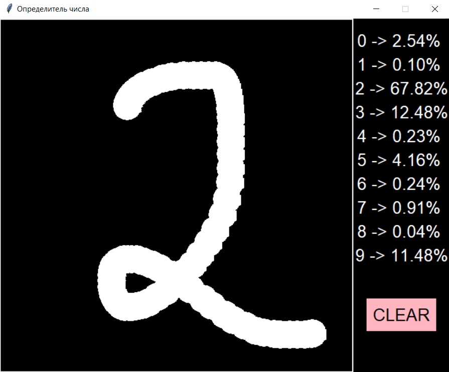
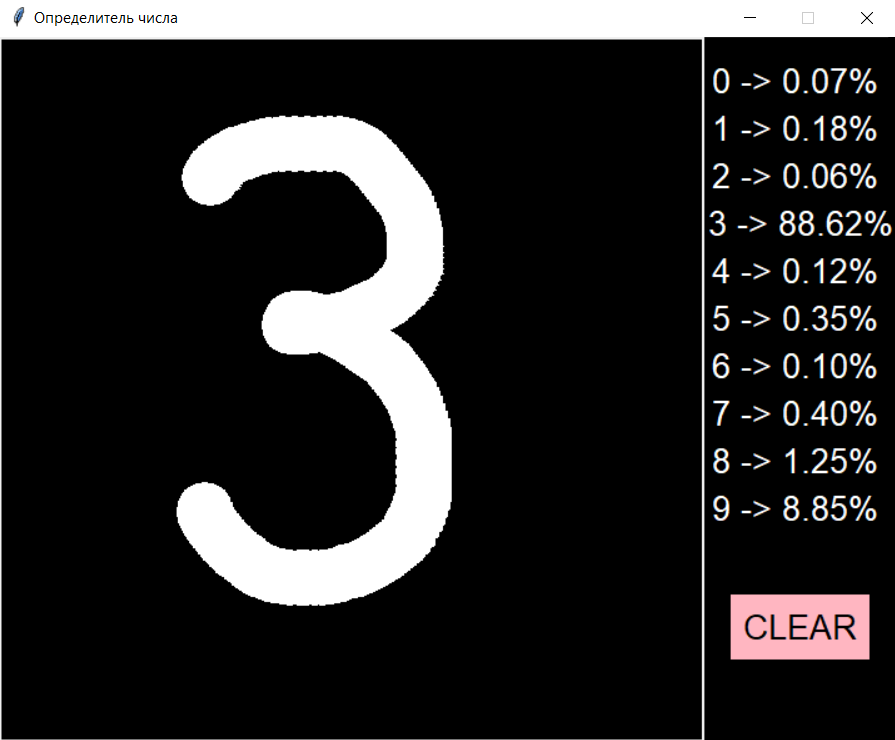
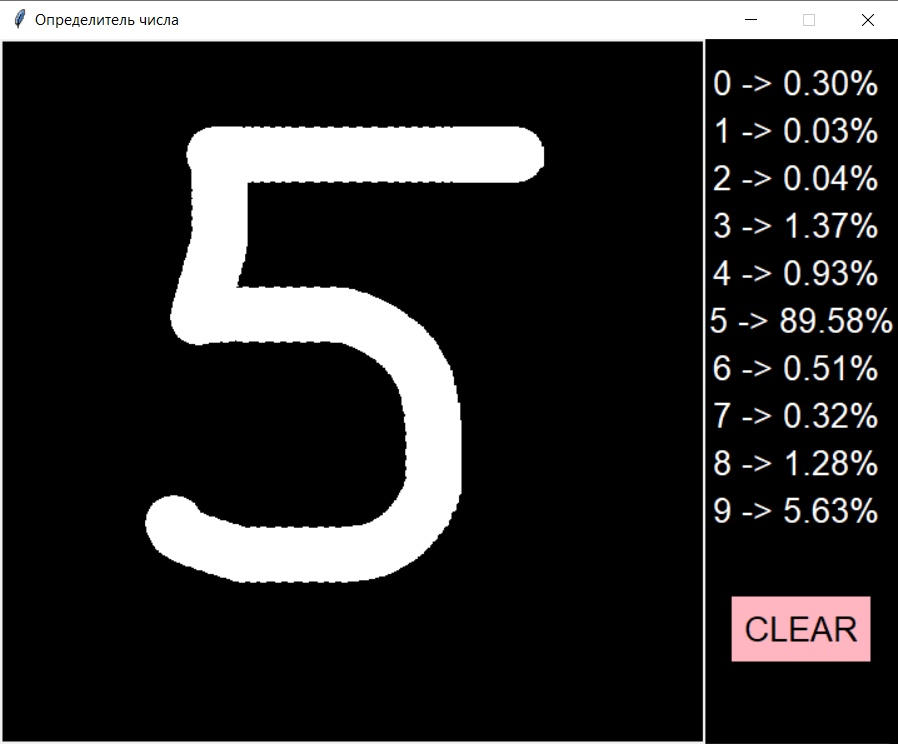

  <h1>Визуализация работы нейросети по угадыванию цифр</h1>

  <h2>Примеры:</h2>

  <h3>Справа цифры и соответствующие вероятности отнесения</h3>

 

 

 

  <h2>Модель неплохо угадала цифры</h2>

